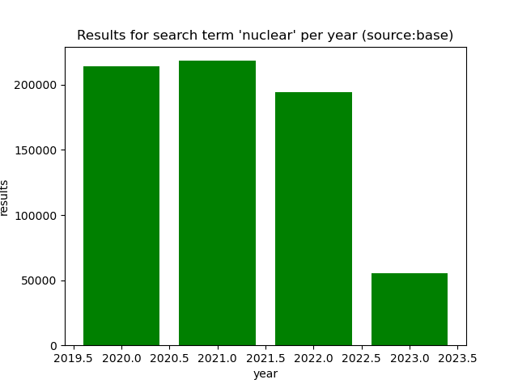

# ResultCount Crawler - Scientific Search Engines
- Crawls searchTerm results over years out of Scientific Search Engines 
- Written to prove and verify scientifc assumptions of a paper
- Exports Charts if you need them, just add at the bottom of the script: 
  - `downloadSearchTermAndSave("<source>", "<term>", <start_year>, <end_year e.g. getCurrentYear()>, <steps=1>)`

## Example
- `downloadSearchTermAndSave("base", "nuclear", 2020, getCurrentYear(),1)`
- returns:
  - 
  - 

## Installation
- `pip install -r requirements.txt`y
- hint: maybe you want to configure TOR as http request proxy ;-)

## Usage
- `python3 main.py`
